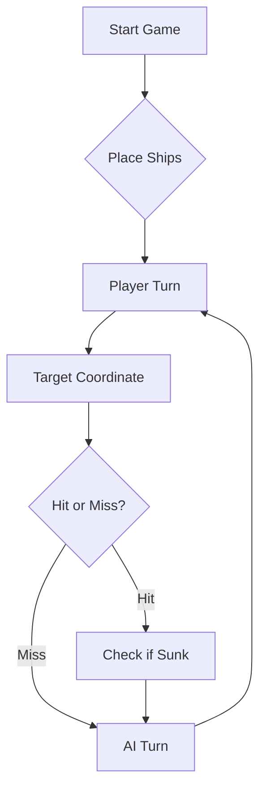

## Project Documentation

The project documentation generated with Javadoc is available at:

[https://ige-124424.github.io/Battleship2/](https://britoeabreu.github.io/Battleship2/battleship/package-summary.html)


# ⚓ Battleship 2.0


> A modern take on the classic naval warfare game, designed for the XVII century setting with updated software engineering patterns.

---

## 📖 Table of Contents
- [Project Overview](#-project-overview)
- [Key Features](#-key-features)
- [Technical Stack](#-technical-stack)
- [Installation & Setup](#-installation--setup)
- [Code Architecture](#-code-architecture)
- [Roadmap](#-roadmap)
- [Contributing](#-contributing)

---

## 🎯 Project Overview
This project serves as a template and reference for students learning **Object-Oriented Programming (OOP)** and **Software Quality**. It simulates a battleship environment where players must strategically place ships and sink the enemy fleet.

### 🎮 The Rules
The game is played on a grid (typically 10x10). The coordinate system is defined as:

$$(x, y) \in \{0, \dots, 9\} \times \{0, \dots, 9\}$$

Hits are calculated based on the intersection of the shot vector and the ship's bounding box.

---

## ✨ Key Features
| Feature | Description | Status |
| :--- | :--- | :---: |
| **Grid System** | Flexible $N \times N$ board generation. | ✅ |
| **Ship Varieties** | Galleons, Frigates, and Brigantines (XVII Century theme). | ✅ |
| **AI Opponent** | Heuristic-based targeting system. | 🚧 |
| **Network Play** | Socket-based multiplayer. | ❌ |

---

## 🛠 Technical Stack
* **Language:** Java 17
* **Build Tool:** Maven / Gradle
* **Testing:** JUnit 5
* **Logging:** Log4j2

---

## 🚀 Installation & Setup

### Prerequisites
* JDK 17 or higher
* Git

### Step-by-Step
1. **Clone the repository:**
   ```bash
   git clone [https://github.com/britoeabreu/Battleship2.git](https://github.com/britoeabreu/Battleship2.git)
   ```
2. **Navigate to directory:**
   ```bash
   cd Battleship2
   ```
3. **Compile and Run:**
   ```bash
   javac Main.java && java Main
   ```

---

## 📚 Documentation

You can access the generated Javadoc here:

👉 [Battleship2 API Documentation](https://britoeabreu.github.io/Battleship2/)


### Core Logic
```java
public class Ship {
    private String name;
    private int size;
    private boolean isSunk;

    // TODO: Implement damage logic
    public void hit() {
        // Implementation here
    }
}
```

### Design Patterns Used:
- **Strategy Pattern:** For different AI difficulty levels.
- **Observer Pattern:** To update the UI when a ship is hit.
</details>

### Logic Flow


---

## 🗺 Roadmap
- [x] Basic grid implementation
- [x] Ship placement validation
- [ ] Add sound effects (SFX)
- [ ] Implement "Fog of War" mechanic
- [ ] **Multiplayer Integration** (High Priority)

---

## 🧪 Testing
We use high-coverage unit testing to ensure game stability. Run tests using:
```bash
mvn test
```

> [!TIP]
> Use the `-Dtest=ClassName` flag to run specific test suites during development.

---

## 🤝 Contributing
Contributions are what make the open-source community such an amazing place to learn, inspire, and create.

1. Fork the Project
2. Create your Feature Branch (`git checkout -b feature/AmazingFeature`)
3. Commit your Changes (`git commit -m 'Add some AmazingFeature'`)
4. Push to the Branch (`git push origin feature/AmazingFeature`)
5. Open a **Pull Request**

---

## 📄 License
Distributed under the MIT License. See `LICENSE` for more information.

---
**Maintained by:** [@britoeabreu](https://github.com/britoeabreu)  
*Created for the Software Engineering students at ISCTE-IUL.*

## PARTE D: PROMPT MELHORADO

Você é um estratega especialista em Batalha Naval.

O seu objetivo é derrotar o adversário usando uma estratégia eficiente de disparo. 
Para isso deve seguir rigorosamente as regras abaixo.

1. Diário de Bordo (Memória)
Mantenha um Diário de Bordo onde regista cada rajada disparada:
- número da rajada (Rajada 1, Rajada 2, ...)
- coordenadas de cada tiro
- resultado de cada tiro (Água, acerto, navio afundado)
Use esta memória para evitar repetir tiros e para melhorar a estratégia.

2. Regras do Tabuleiro
- O tabuleiro vai de A a J (linhas) e 1 a 10 (colunas).
- Nunca dispare fora destes limites.
- Nunca repita tiros já efetuados.

3. Estratégia Geral
Enquanto não houver acertos:
- espalhe os tiros pelo tabuleiro para maximizar a cobertura.
- use um padrão de espaçamento (ex: saltar casas) para procurar navios maiores.

4. Estratégia após um acerto
Se um tiro acertar num navio:
- na rajada seguinte dispare nas posições adjacentes:
  Norte, Sul, Este e Oeste.
- isso permite descobrir a orientação do navio.

5. Afundar um navio
Quando descobrir a orientação do navio:
- continue a disparar nessa direção até o navio ser afundado.

6. Navio Afundado
Quando um navio for afundado:
- marque todas as casas à volta (incluindo diagonais) como água.
- nunca dispare nessas posições, pois os navios não podem tocar-se.

7. Exceção do Galeão
O Galeão tem forma de T.
Por isso, mesmo que existam diagonais ocupadas após um acerto, considere a possibilidade de fazer parte da forma do Galeão.

8. Geração da Rajada
Cada jogada deve gerar exatamente 3 tiros no seguinte formato JSON:

[
 {"row": "A", "column": 5},
 {"row": "C", "column": 7},
 {"row": "F", "column": 2}
]

Nunca gere tiros repetidos ou fora do tabuleiro.

9. Objetivo
Use toda a informação do Diário de Bordo para maximizar a probabilidade de encontrar e afundar os navios inimigos o mais rapidamente possível.

Exemplo de raciocínio estratégico:

Rajada 1:
[
 {"row": "E", "column": 5},
 {"row": "F", "column": 5},
 {"row": "G", "column": 5}
]

Resultado:
Acerto numa Nau em F5.

Estratégia seguinte:
Na rajada seguinte disparar em E5, G5, F4 ou F6 para descobrir a orientação do navio.

## PRINTS de uma conversa de exemplo com o LLM a jogar


